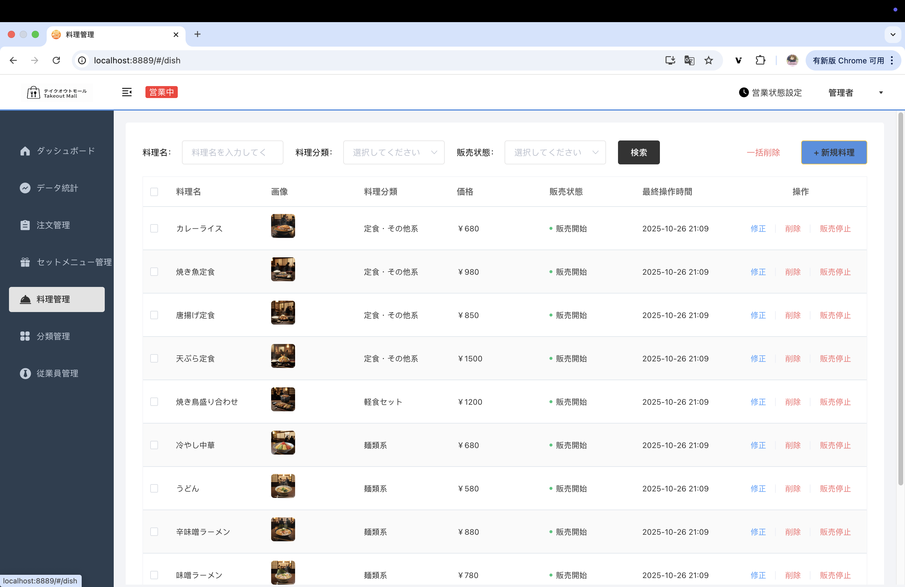

# テイクアウト・マルシェ管理システム - 操作ガイド

## 目次

1. [システム概要](#システム概要)
2. [管理画面操作ガイド](#管理画面操作ガイド)
3. [ミニプログラム操作ガイド](#ミニプログラム操作ガイド)
4. [よくある操作](#よくある操作)

---

## システム概要

このシステムは、テイクアウト配送サービスの管理システムで、以下の2つのインターフェースを提供しています：

- **管理画面（管理者用）**: Webブラウザでアクセスする管理ダッシュボード
- **ミニプログラム（顧客用）**: WeChatミニプログラムでアクセスする注文アプリ

---

## 管理画面操作ガイド

### 1. ダッシュボード

**アクセス**: `http://localhost:8889/#/dashboard`

**主要機能**:
- 今日の売上・注文統計を一覧表示
- 注文ステータス別の件数表示（受注待ち、配送待ち、完了、キャンセル）
- 料理・セットメニューの在庫状況
- リアルタイムの注文情報

**見方**:
- **今日のデータ**: 売上額、有効注文数、注文完了率、平均客単価、新規ユーザー数
- **注文管理**: ステータス別の注文数を表示
- **料理総覧**: 販売開始/停止中の料理数
- **セットメニュー総覧**: 販売開始/停止中のセットメニュー数

---

### 2. データ統計

**アクセス**: `http://localhost:8889/#/statistics`

**主要機能**:
- 売上統計の推移をグラフ表示
- ユーザー数の推移表示
- 注文完了率・注文数統計
- 売上ランキングTOP10

**操作方法**:
1. 期間選択: 「昨日」「近7日」「近30日」「今週」「今月」から選択
2. データエクスポート: 右上の「データエクスポート」ボタンからCSV出力

---

### 3. 注文管理

**アクセス**: `http://localhost:8889/#/order`

**主要機能**:
- 全注文の一覧表示
- ステータス別フィルタリング
- 注文詳細の確認

**操作方法**:
1. **ステータスフィルター**: 全注文、受注待ち、配送待ち、配送中、完了、キャンセル
2. **検索機能**:
   - 注文番号で検索
   - 携帯電話番号で検索
   - 注文時間の範囲指定
3. **注文詳細**: 各注文の「詳細」ボタンで注文内容を確認

**注文情報**:
- 注文番号、注文状態、ユーザー名、電話番号、住所、注文時間、実収金額

---

### 4. セットメニュー管理

**アクセス**: `http://localhost:8889/#/setmeal`

**主要機能**:
- セットメニューの一覧表示・追加・編集・削除
- 販売状態の変更

**操作方法**:
1. **検索**: セットメニュー名、分類、販売状態で絞り込み
2. **追加**: 「+新規セットメニュー」ボタンから新規作成
3. **編集**: 各セットメニューの「修正」ボタン
4. **販売開始/停止**: 「販売停止」/「販売開始」ボタン
5. **削除**: 「削除」ボタンまたは「一括削除」機能

---

### 5. 料理管理

**アクセス**: `http://localhost:8889/#/dish`

**主要機能**:
- 料理の一覧表示・追加・編集・削除
- 販売状態の変更

**操作方法**:
1. **検索**: 料理名、分類、販売状態で検索
2. **追加**: 「+新規料理」ボタンから新規作成
3. **編集**: 各料理の「修正」ボタン
4. **販売状態変更**: 「販売停止」/「販売開始」ボタン
5. **削除**: 個別削除または一括削除

**表示情報**:
- 料理名、画像、料理分類、価格、販売状態、最終操作時間

---

### 6. 分類管理

**アクセス**: `http://localhost:8889/#/category`

**主要機能**:
- 料理分類の管理
- セットメニュー分類の管理

**操作方法**:
1. **料理分類の追加**: 「+新規料理分類」ボタン
2. **セットメニュー分類の追加**: 「+新規セットメニュー分類」ボタン
3. **編集**: 各分類の「修正」ボタン
4. **削除/無効化**: 「削除」または「無効」ボタン

**分類情報**:
- 分類名、分類タイプ（料理/セットメニュー）、並び順、状態、操作時間

---

### 7. 従業員管理

**アクセス**: `http://localhost:8889/#/employee`

**主要機能**:
- 従業員情報の管理
- アカウントの有効/無効化

**操作方法**:
1. **検索**: 従業員名で検索
2. **追加**: 「+従業員追加」ボタン
3. **編集**: 各従業員の「編集」ボタン
4. **無効化**: 「無効」ボタンでアカウントを無効化

**表示情報**:
- 従業員名、アカウント、携帯電話番号、アカウント状態、最終操作時間

---

## ミニプログラム操作ガイド

### 1. ホーム画面（メニュー閲覧）

**主要機能**:
- 料理・セットメニューの閲覧
- カテゴリ別の商品表示
- ショッピングカートへの追加

**操作方法**:
1. **カテゴリ選択**: 左側のサイドバーからカテゴリを選択
2. **商品を選択**: 各商品の「規格を選択」ボタンをクリック
3. **カートに追加**: 規格を選択後、自動的にカートに追加
4. **会計**: 下部の「会計へ」ボタンからチェックアウトへ進む

**表示情報**:
- 店舗情報（営業状態、距離、配送料、配達予定時間）
- 商品名、説明、価格、画像

---

### 2. 注文確認画面

**主要機能**:
- 注文内容の確認
- 配送先・配達時間の指定
- 支払い方法の選択

**操作方法**:
1. **配送先確認**: 住所を確認し、必要に応じて変更
2. **配達時間**: 「すぐに配達」または時間指定
3. **備考入力**: 特記事項があれば記入
4. **支払い方法**: 微信支付などの支払い方法を選択
5. **注文送信**: 「支払う」ボタンで注文確定

---

### 3. 支払い画面

**主要機能**:
- 注文金額の確認
- 支払いの実行

**操作方法**:
1. **支払い金額確認**: 表示されている金額を確認
2. **支払い残り時間確認**: 支払い期限を確認
3. **支払い方法確認**: 選択した支払い方法を確認
4. **支払い実行**: 「支払いを確認」ボタンをクリック

---

### 4. マイページ（注文履歴）

**主要機能**:
- 注文履歴の閲覧
- 住所管理
- 再注文

**操作方法**:
1. **注文履歴確認**: 過去の注文を一覧表示
2. **注文状態確認**: 支払い待ち、配達中、完了など
3. **再注文**: 「もう一度」ボタンで同じ商品を再度注文
4. **支払い**: 「支払う」ボタンで未払いの注文を支払い
5. **住所管理**: 「住所管理」リンクから配送先を管理

**表示情報**:
- 注文日時、注文状態、商品名、数量、金額

---

## よくある操作

### 新規料理を追加する

1. 左側メニューから「料理管理」を選択
2. 右上の「+新規料理」ボタンをクリック
3. 料理名、分類、価格、画像などを入力
4. 「保存」ボタンをクリック

### 注文ステータスを変更する

1. 左側メニューから「注文管理」を選択
2. 該当する注文の「詳細」ボタンをクリック
3. 注文詳細画面でステータスを変更
4. 「保存」ボタンをクリック

### 販売停止中の料理を販売開始する

1. 左側メニューから「料理管理」を選択
2. 販売停止中の料理の「販売開始」ボタンをクリック
3. 確認ダイアログで「確認」をクリック

### 顧客が注文をキャンセルする

1. ミニプログラムの「マイページ」を開く
2. 注文履歴からキャンセルしたい注文を選択
3. 「キャンセル」ボタンをクリック
4. 確認ダイアログで「確認」をクリック

---

## トラブルシューティング

### 画像が表示されない

- 原因: AliOSSの画像URLが403エラーを返している
- 対応: 
  1. 管理画面で画像を再アップロード
  2. AliOSSのアクセス権限を確認
  3. 画像URLが正しく設定されているか確認

### 注文が確定しない

- 確認事項:
  - 支払いが完了しているか
  - 注文ステータスが「支払い待ち」ではないか
  - ネットワーク接続が正常か

### ユーザーがログインできない

- 確認事項:
  - ユーザー名とパスワードが正しいか
  - アカウントが有効化されているか
  - システムが正常に動作しているか

---

## 連絡先

システムに関する質問や問題がある場合は、プロジェクトのIssueページで報告してください。
